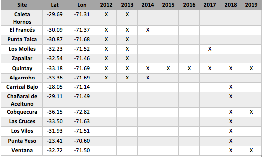

```{r setup, include=FALSE}

knitr::opts_chunk$set(echo = F, warning = F, message = F)
library(tinytex)
library(tidyverse) 
library(knitr)
library(gridExtra)
library(kableExtra)
library(stringr)
library(broom)
library(MuMIn)
library(bookdown)

```

## Introducción

  La fotosíntesis es el proceso evolutivo que ha permitido uno de los principales cambios para hacer la tierra habitable a través de la captura del carbono inorgánico presente en la atmósfera y posterior liberación de oxígeno [@martin2007eukaryote]. Las macroalgas, aunque subestimadas por su rol como sumideros de carbono, aportan hasta un 10% de la productividad primaria neta mundial [@krause2016substantial]. De este porcentaje, un 40% de la producción total representa un excedente de crecimiento, el cual es utilizado por herbívoros, filtradores y suspensívoros, siendo la base de las cadenas tróficas y sustentando una diversidad de especies y pesquerías en las zonas costeras [@duarte2013role;@duarte2017reviews]. Otro destino de la productividad son los reservorios marinos donde se ha descrito que hasta 14 Tg C año-1 de C orgánico proveniente de las macroalgas es almacenado en los sedimentos y 153 Tg C año-1 son trasladas hacia zonas profundas del océano, similar al aporte de generado por pastos marinos, marismas y manglares [@dierssen2009potential; @krause2016substantial]. Así, la importancia de las macroalgas, junto con estos otros ecosistemas costeros, han cobrado mayor relevancia en las estrategias de carbono azul, que buscan la conservación y restauración de estos hábitats, por su rol en la disminución de gases de efecto invernadero y la mitigación de los efectos del cambio climático [@duarte2013role;@macreadie2019future].
    
  Las macroalgas pardas dominan un 26% de las costas del mundo y debido a su gran biomasa forman parte de los ecosistemas más productivos en zonas costeras frías y templadas, con importantes funciones ecológicas y servicios ecosistémicos [@wernberg2019status; @macreadie2019future;@filbee2020substantial]. Este grupo de algas, pertenecientes al orden Laminariales, presentan una gran diversidad morfológica y estrategias de vida (perennes/anuales), lo que va a determinar en parte, las diferencias en las tasas de producción a lo largo de las regiones donde se distribuyen y entre especies [@steneck2002kelp]. Su productividad puede alcanzar valores similares a los producidos por bosques lluviosos tropicales, que alcanzan en promedio 2200 g de peso seco m-2 año-1 [@krumhansl2016global; @wernberg2019status]. Sin embargo, las estimaciones de productividad primaria (NPP), que representa una medición de la producción de materia orgánica (o gramos de carbono) por unidad de área y tiempo [@falkowski2007introduction], puede revelar diferentes procesos subyacentes que implican producción de biomasa (i.e. crecimiento, reclutamiento, fotosíntesis, acumulación y pérdida de biomasa, etc,  [@reed2008biomass] dependiendo de la metodología utilizada para estimar la NPP.
  
  Entre los principales factores ambientales que modulan la productividad se encuentran la luz, la temperatura y los nutrientes [@edding2006fotosintesis; @smale2020environmental;@wernberg2019status]. La luz tiene control directo sobre la fotosíntesis y el crecimiento, y esta varía durante las estaciones del año controlando los patrones de crecimiento anuales de las macroalgas pardas [@tala2005growth; @wernberg2019status; @reed2008biomass]. Junto con la luz, la disponibilidad de nutrientes, principalmente el nitrógeno, también afectan el crecimiento, pero algunas especies de macroalgas pardas presentan estrategias de crecimiento, el cual es realizado durante las temporadas de mayor disponibilidad de nutrientes, y utilizando las reservas energéticas producidas en períodos de alta irradiación, cuando la fotosíntesis es máxima [@tala2005growth; @edding2006fotosintesis]. Finalmente, la temperatura es uno los factores más importantes descritos que determinan la productividad primaria, considerándose el calentamiento global como una de las más grandes amenazas que están enfrentando los bosques de macroalgas pardas a nivel global [@bearham2013temperature; @smale2020environmental]. Así, la interacción entre estos factores ambientales, y su variación en el tiempo pueden modular los patrones de producción de las poblaciones de macroalgas pardas [@graham45global].
  
  En Chile, los fondos submareales rocosos están dominador por Lessonia trabeculata  [@villouta1986lessonia], quien presenta una distribución desde los 18º hasta los 40ºS, y alcanza profundidades de hasta 40 m (thiel2007humboldt). Aunque tiene características perennes, la dinámica de sus poblaciones se ha visto estar ampliamente determinada por los factores ambientales y ecológicos de mesoescala (10-100s km) [@vega2005population; @perez2017exploring]. A lo largo de su distribución, las poblaciones de *L. trabeculata* son favorecidas por procesos de surgencia asociados a la corriente de Humboldt, que aumentan la resiliencia de las poblaciones frente a Eventos de Oscilación del sur El Niño (ENSO), ya que estas condiciones proven una mayor estabilidad térmica y aporte de nutrientes [@vega2005population]. Sin embargo, las poblaciones de *L. trabeculat* han disminuido principalmente debido a la explotación de estas algas, debido a que la pesquería desde el año 2002 incrementó progresivamente a lo largo de la costa norte de Chile, por lo que algunas regulaciones mediante cuotas y vedas controlan la pesquería [@vasquez2014economic]. Actualmente la extracción se ha expandido hacia la zona sur del país, sin ningún tipo de restricción, excepto la que rige sobre las áreas de manejo y recursos bentónicos (AMERB), y muy pocos estudios han logrado entender el efecto sobre las comunidades asociadas a estas macroalgas. Bajo el contexto de explotación de *L. trabeculata* y la variación en las condiciones ambientales por causa del cambio climático, se hace relevante realizar estimaciones sobre los procesos ecosistémicos que estas algas proveen, como lo es la productividad primaria [@pettorelli2018satellite]
  
  *Lessonia trabeculata*, al igual que otras macroalgas, se ha descrito por tener una estrategia de anticipación a la temporada y presenta un periodo de mayor crecimiento durante los meses de octubre y noviembre con una producción de 0.04 g d-1 de peso seco diario [@tala2007first]. Este crecimiento ocurre en el tejido meristemático ubicado entre la base de las láminas y el estipe, y a medida que las láminas crecen, el tejido se pierde en la zona apical, tejido que es traspasado a la producción secundaria o hacia la columna de agua como material particulado [@tala2005growth;@tala2007first;@edding2006fotosintesis]. Hasta 11 g de peso seco m^2^ d^1^ (2.46 gC m^2^ d^1^, [@tala2007first]) es producido por esta especie, y junto con *L. spicata* presentan valores altamente superiores al compararlas con otras macroalgas pardas [@krumhansl2012production]. Sin embargo, esta estimación corresponde a una población específica en la zona norte de Chile, específicamente en la localidad de Tongoy (30º15’S–71º15’W) [@tala2007first], y no existen otras estimaciones de la productividad de L. trabeculata a lo largo de la costa de Chile.
  
  Tanto las mediciones directas de la biomasa a intervalos de tiempo y área (i.e. Standing stock), como las mediciones del crecimiento, han sido considerados como buenos proxys de la productividad [@edding2006fotosintesis], y la información de la densidad, morfología y tallas de *L. trabeculata* son útiles para realizar estas estimaciones a partir de poblaciones naturales a lo largo de su distribución. Para poder extrapolar la información de biomasa, la tallas del disco se ha descrito por ser un buen predictor del peso, presentando una relación exponencial [@vasquez1991variables]. Sin embargo, es relevante entender que las formas de crecimiento en esta especie varían según las condiciones locales (i.e exposición, herbivoría, entre otros) y por lo tanto esta relación puede variar dependiendo del sitio.

   Al igual como se ha observado en otras especies de macroalgas pardas se espera que la productividad varíe a lo largo de un gradiente latitudinal debido al cambio en las condiciones ambientales (i.e. temperatura). En un contexto temporal, se sabe que los patrones de crecimiento están ampliamente determinados por las condiciones ambientales a lo largo de las estaciones del año [@tala2007first; @smale2020environmental]. Sin embargo, la variación en la biomasa acumulada para especies perennes como *L. trabeculata*, debería permanecer estable a lo largo del año independiente de la localidad, a menos que la población sea explotada. Uno de los efectos descritos a causa de la explotación de estas algas ha sido la disminución en la estructura de tallas de las poblaciones naturales, donde algas con discos más pequeños empiezan a dominar el bosque, en un proceso denominado juvenilización [@figueroarevista]. La disminución de las tallas en las poblaciones, se verá reflejada directamente en la biomasa acumulada en las poblaciones naturales, por lo que sitios con mayor historia de explotación debieran reflejar una menor producción de biomasa. 

## Objetivos 

1.	Determinar la relación entre la longitud del disco y el peso de *L. trabeculata* en diferentes localidades de la zona norte y centro de Chile y comparar los parámetros con aquellos previamente descritos para la especie.

2.	Evaluar la variación de la biomasa acumulada en un gradiente latitudinal en diferentes escalas de tiempo (estacionales y anuales).

## Metodología
```{r 2012-2014, echo=FALSE}
F11110351<-read.csv("2012-2014.csv") %>% filter(Subset == "Kelp") %>% select(-c(Subset,Transect,Temperature, Visbility,DepthRange,Holdfast.Use,Blade.Use,Cover, allometric, a,b, Biomass)) %>% mutate(DF= rep("F11110351", times= length(Site)), Stipes= rep("NA", times=length(Site)), Length=rep("NA", times=length(Site))) %>% rename(Transect= "Transects")
F11110351$Site<-as.character(F11110351$Site)


##cambio de nombre a un sitio para std con otras bd

F11110351$Site <- gsub("LosMolles", "Los Molles protected", F11110351$Site)


```
```{r 2015, echo=FALSE}

F1140841<-read.csv("2015.csv") %>% filter(Subset == "kelp") %>% select(-c(Subset,Temperature, Visbility, Holdfast.Use,Blade.Use,Cover...,X,Biomass)) %>% mutate(DF= rep("F1140841", times= length(Site)), Length=rep("NA", times=length(Site))) %>% rename(Stipes= "no..stipes", Size= "Size.cm.", Station="station")

F1140841$Site <- gsub("Quintay", "QuintayAMERB", F1140841$Site)
F1140841$Site <- gsub("El Franc\x8es", "TotoralilloOA", F1140841$Site)
F1140841$Site <- gsub("Algarrobo", "AlgarroboOA", F1140841$Site)

#Rellenar coordenadas
cond1= (F1140841$Site== "AlgarroboOA")
F1140841$Latitude[cond1] = "-33.36483661"
F1140841$Longitude[cond1] = "-71.69101847"

cond2= (F1140841$Site== "TotoralilloOA")
F1140841$Latitude[cond2] = "-30.0939569"
F1140841$Longitude[cond2] = "-71.37972619"

cond3= (F1140841$Site== "QuintayAMERB")
F1140841$Latitude[cond3] = "-33.19193931"
F1140841$Longitude[cond3] = "-71.70033633"

```
```{r 2015-2016, echo=FALSE}
F1151094<-read.csv("2015-2017.csv") %>% filter(Habitat == "kelp") %>% 
  select(-c(Survey,Habitat,Sampler, High.1,High.2, Mean.High,comentario,Data_Entry,Num_parches)) %>%
  mutate(DF=rep("F1151094", times= length(Site)),Season=rep("NA", times=length(Site)), Latitude=rep("NA", times=length(Site)), Longitude=rep("NA", times=length(Site)), Phase=rep("NA", times=length(Site))) %>% rename(Series ="serie",  Station= "Station.replicate", Replicate= "Pseudoreplicate",Size= "Width")

#Cambio de nombre de los sitios
F1151094$Site[F1151094$Site == "Quintay "] = "Quintay"
F1151094$Site[F1151094$Site == "LosMolles"] = "Los Molles"
F1151094$Site <- paste(F1151094$Site,F1151094$Exposure)

##Rellenamos las columnas de latitud y longitud


condicion1= (F1151094$Site== "Quintay exposed")  
condicion2= (F1151094$Site== "Quintay protected")
condicion5= (F1151094$Site== "Quintay protected")
condicion3= (F1151094$Site== "Los Molles exposed") 
condicion4= (F1151094$Site== "Los Molles protected")

#Completamos las coordenadas
F1151094$Latitude[condicion1] = "-33.143806"
F1151094$Longitude[condicion1]= "-71.711944"
F1151094$Latitude[condicion2] = "-33.19193931"
F1151094$Longitude[condicion2] = "-71.70033633"
F1151094$Latitude[condicion3] = "-32.23857"
F1151094$Longitude[condicion3] = "-71.52684"
F1151094$Latitude[condicion4] = "-32.230642"
F1151094$Longitude[condicion4] = "-71.523598"


#Cada sitio tiene una zona profunda y en cada zona hay tres transectos, y debería ponerles 1, 2 , 3...4, 5, 6....

condicion5=(F1151094$Zone =="shallow") & (F1151094$Transect =="1") 
F1151094$Transect[condicion5] = "4"
condicion6=(F1151094$Zone =="shallow") & (F1151094$Transect =="2") 
F1151094$Transect[condicion6] = "5"
condicion7=(F1151094$Zone =="shallow") & (F1151094$Transect =="3") 
F1151094$Transect[condicion7] = "6"


F1151094std= F1151094 %>% select(-c(Exposure,Zone)) %>% mutate(Season=rep("NA", times=length(Site)))
F1151094std$Site <- gsub("Quintay protected", "QuintayAMERB", F1151094std$Site)

```
```{r Alldata, echo=F}

Alldata= rbind(F11110351,F1140841,F1151094std)
Alldata$Size<-as.numeric(Alldata$Size)
Alldata$Site<-as.factor(Alldata$Site)
Alldata$Biomass= ((Alldata$Size^2.12927)*(5.29154))/1000
Alldata$Latitude<-as.numeric(Alldata$Latitude)

```

  A partir de diferentes bases de datos (Figura \@ref(fig:df)) provenientes de proyectos Fondecyt y de monitoreos realizados en áreas de manejo de recursos bentónicos (AMERB) se realizó una estimación de la biomasa acumulada en las poblaciones de *Lessonia trabeculata*, como un proxy de la productividad primaria de esta especie, en un rango latitudinal desde los `r min(Alldata$Latitude, na.rm = F)` ºS hasta `r max(Alldata$Latitude, na.rm = F)` con información que fluctua desde el año 2012 al 2019.

```{r df, echo= F, fig.cap="Información de los monitoreso de Lessonia trabeculata para 13 sitios y 8 años en Chile disponible en las diferentes bases de datos"}

```

  En los diferentes proyectos, la información sobre la densidad y estructura de talla de *L. trabeculata* fue realizada mediante buceo autónomo en transectos equidistantes y perpendiculares a la línea de costa, los cuales varían en longitud dependiendo del proyecto (i.e 25, 50 o 100 m) y abarcan profundidades entre los 20 y 5 m. Las mediciones de la morfología de las algas fueron realizadas en cuadrantes de 1m^2^ en estaciones (cada 5 o 10 m) a lo largo del transecto. Todas las bases de datos cuentan con información del diámetro máximo del disco (D) y abundancia de algas por cuadrante, y en algunos casos se cuentan con mayor detalle la morfología, agregandose el número de estipes (E) y largo total (LT).

```{r bdPeso, echo=FALSE}
Peso<-read.csv("pesoalgasIFOP.csv") %>% filter(Especie == "Lessonia trabeculata") %>% mutate(logPeso= log(peso), logDisco= log(Diametro.extraida)) %>% rename(Sitio= "AMERB") %>% mutate(Latitude =rep("", times=length(Serie), Longitud= rep("", times= length(Serie))))
Peso$Sitio <- gsub("Quintay sector B", "Quintay protected", Peso$Sitio)
Peso$Sitio <- gsub("Quintay sector A", "Quintay protected", Peso$Sitio)
Peso$Sitio<-as.factor(Peso$Sitio)


conQ= (Peso$Sitio== "Quintay protected")
Peso$Latitude[conQ] = "-23.415222"
Peso$Longitude[conQ] = "-70.600943"

conC= (Peso$Sitio== "Cobquecura")
Peso$Latitude[conC] = "-36.164765"
Peso$Longitude[conC] = "-72.816642"

conV= (Peso$Sitio== "Ventana")
Peso$Latitude[conV] = "-32.735717"
Peso$Longitude[conV] = "-71.503350"

conVi= (Peso$Sitio== "Los Vilos sector C")
Peso$Latitude[conVi] = "-31.934100"
Peso$Longitude[conVi] = "-71.517767"

conCa= (Peso$Sitio== "Carrizal Bajo")
Peso$Latitude[conCa] = "-28.040500"
Peso$Longitude[conCa] = "-71.152083"

conPY= (Peso$Sitio== "Punta el Yeso")
Peso$Latitude[conPY] = "-23.415222"
Peso$Longitude[conPY] = "-70.600943"


```

  Para calcular la biomasa a partir de la talla de los discos de L. trabeculata se utilizó la ecuación 
$$
  \begin{aligned}
  B = aL^b 
  \end{aligned}
$$ 
donde L, corresponde al diámetro del disco y, a y b son constantes de la relación entre el diámetro del disco y el peso. 
  Para determinar si esta la relación varía entre sitios, se utilizó una base de datos de `r length(levels(Peso$Sitio))` sitios entre los `r min(Peso$Latitude, na.rm = F) `ºS y los `r max(Peso$Latitude, na.rm = F)`ºW. En cada sitio, 30 algas fueron extraídas desde el disco de adhesión obteniendo el alga completa y variables morfológicas, como el diámetro del disco (L), el número de estipes (E), y el largo total (LT) fueron medidos. Las diferencias entre sitios y los parametros de la relación fueron estimados mediante un análisis linear generalizado (GLM), y el intercepto y la pendiente fueron usados como los parametros a y b de la ecuación de biomasa, respectivamente. Posteriormente un anova al GLM fue realizado para determinar si el efecto del factor sitio era siginificativo.

  Para determinar como varía la biomasa de los bosques de *L. trabeculata* a lo largo del gradiente latitudinal y temporal, se utilizaron sólo las bases de datos de los años 2012 y 2013. Durante estos años, un total de  `r Alldata %>% filter(DF=="F11110351", Season !="Summer 2014") %>% summarise(length(levels(Site)))` sitios entre los `r Alldata %>% filter(DF=="F11110351", Season !="Summer 2014") %>% summarise(max(Latitude))`ºS y los `r Alldata %>% filter(DF=="F11110351", Season !="Summer 2014") %>% summarise(min(Latitude))`ºW fueron monitoreados en las temporadas de otoño y primavera. A partir de esta información, diferentes modelos lineales generalizados (GLM, distribución de errores "gaussian") fueron utilizados para entender los factores que estarían determinando la variación en biomasa y se seleccionó el modelo que mejor explicara la variación a través del paquete broom y seleccionando aquel con un menor AIC (Criterio de información de Akaike, [@crawley2012r]).

## Resultados


  La relación entre el diametro máximo del disco y el peso de *L. trabeculata* en diferentes localidades presenta una relación exponencial, que al ser transformada a logaritmo pudo ser ajustada como una relación lineal (Figura \@ref(fig:plotPeso)). La biomasa de *L. trabeculata* varió de manera significativa para la localidad de Los Vilos (Tabla \@ref(tab:tabla), color verde en Figura \@ref(fig:plotPeso)). Sin embargo, ya que sólo un sitio generó diferencias significativas, los parametros de interecepto (5.279934) y pendiente (2.1252435) fueron utilizados para aplicarse a la ecuación de biomasa.

```{r plotPeso, echo=F, fig.cap="Relación entre el logaritmo del Diametro del Disco (cm) y el logaritmo del Peso (g) de *Lessonia trabeculata*"}
require(ggplot2)
ggplot(Peso, aes(x=logDisco , y=logPeso, colour =Latitude))+ theme_bw()+
 geom_smooth(method = "lm", se=FALSE, formula = y ~ x) + geom_point()


```


```{r tabla, echo=FALSE}

modelPESO<-glm(peso~I(log(Diametro.extraida))+Sitio, family = quasipoisson, data=Peso)
tabla<-tidy(modelPESO) 
kbl(tabla, caption="Resultados del modelo lineal generalizado (GLM) evaluando la relación entre el peso y la talla de Lessonia trabeculata por sitio", booktabs = T) %>% kable_styling(position = "center") 


```


  Al estimar la biomasa en las 7 localidades durante los años 2012 y 2013, se pudo observar que esta va aumentando a  medida que aumenta latitud (Figura \@ref(fig:plotBiomasa)), pero vuelve a disminuir en la látitud más al sur, correspondiente a la localidad de Algarrobo. Junto con Algarrbo, la localidad de Totoralillo  (-30.0939569ºS) se encontraron las menores biomasas. Por el contrario, la mayor biomasa se encontró en la latitud -32.54715419ºS, en la localidad de Zapallar (V región), seguido de la latitud -30.87694613ºS en Punta de Talca (VI región). 

  La variación de la biomasa entre el las temporadas de Otoño y Primavera en los años 2012 y 2013 tendió al aumento en la mayoría de las localidades, excepto para la localidad de Los Molles (-32.23052136)(Figura \@ref(fig:plotBiomasa)). La biomasa varió de manera significativa a través de las temporadas y las localidades (Tabla \@ref(tab:tablaModelos)), específicamente en la latitud -32.5471541ºS (Zapallar), donde la temporada de Primavera 2012 la biomasa disminuyó a menos de la mitad en comparación con primavera del 2013. La otra latitud que presentó diferencias significativas correspondió a -30.87694613ºS (Punta Talca), donde ambas temporadas de primavera fueron menores a las temporadas de otoño (Figura \@ref(fig:plotBiomasa)).


```{r Analisis Biomasa, echo=F}
Quad<-Alldata %>% filter(DF=="F11110351", Season !="Summer 2014") %>% group_by(Site, Season, Latitude, Transect, Replicate) %>% summarise(Biomassm2= sum(Biomass)) 
Transect<-Quad %>% group_by(Season, Site, Latitude, Transect) %>% summarise(meanT=mean(Biomassm2))
Transect$Season<-as.factor(Transect$Season)
Transect$Latitude<-as.factor(Transect$Latitude)
Sitebiomass<-Transect %>% group_by(Season, Site, Latitude) %>% summarise(meanB=mean(meanT), se=sd(meanT)/sqrt(4)) %>% arrange(Latitude)##terminar el error estandar
Sitebiomasstotal<-Transect %>% group_by(Site, Latitude) %>% summarise(meanB=mean(meanT), se=sd(meanT)/sqrt(4)) %>% arrange(Latitude)##terminar el error estandar


#modelos
model1<-glm(meanT~Latitude, family= gaussian, data=Transect) 
model2<-glm(meanT~Season, family= gaussian, data=Transect) 
model3<-glm(meanT~Latitude+Season, family= gaussian, data=Transect) 
model4<-glm(meanT~Latitude*Season, family= gaussian, data=Transect)
Modelo1 <- glance(model1) %>% dplyr::select(null.deviance, df.null,deviance,df.residual,AIC) %>% mutate(Modelo = "Model1")
Modelo2 <- glance(model2) %>% dplyr::select(null.deviance, df.null,deviance,df.residual,AIC) %>% mutate(Modelo = "Model2")
Modelo3 <- glance(model3) %>% dplyr::select(null.deviance, df.null,deviance,df.residual,AIC) %>% mutate(Modelo = "Model3")
Modelo4 <- glance(model3) %>% dplyr::select(null.deviance, df.null,deviance,df.residual,AIC) %>% mutate(Modelo = "Model4")
Modelos <- bind_rows(Modelo1, Modelo2, Modelo3,Modelo4 ) %>% arrange(AIC) 

```
```{r tablaModelos}
tablaModelosBiomass<-tidy(model3)
 
kbl(tablaModelosBiomass, caption="Resultados del modelo lineal generalizado (GLM: Biomasa ~ Latitud + Temporadas) entre la biomasa de *Lessonia trabeculata* entre temporadas otoño y primavera entre 2012 y 2013 en un gradiente latitudinal. ", booktabs = T) %>% kable_styling(position = "center") 
```


```{r plotBiomasa, echo=F,fig.cap="Variación de la biomasa de *Lessonia trabeculata* a lo largo de las temporadas de otoño y primavera durante los años 2012 y 2013 en un gradiente latitudinal entre los 29º-33ºS"}

ggplot(Sitebiomass, aes(x=fct_relevel(Season, "Fall2012", 
    "Spring2012","Fall2013", "Spring2013"), y=meanB))+ ggtitle('Biomasa Lessonia trabeculata')+
  geom_bar(position = "dodge", stat = "identity", width = 0.9) +
       scale_fill_brewer(palette = 3)+
  labs(x= "Season" ,y="Biomasa/m2")+
  geom_errorbar(aes(ymin=meanB-se, ymax= meanB+se),width=0.1,
                position=position_dodge(.9))+ theme_classic()+facet_wrap(Latitude~., ncol=1, nrow = 7,)

```


## Discusión

  Al evaluar la relación entre el disco de *L.trabeculata* y su peso, se observó uno de los sitios fue significativamente diferente, entregando un efecto significativo entre sitios, sin embargo, los parametros de la relación fueron diferentes de los parametros previamente descritos para la especie (interecepto=4.93 y pendiente=0.15) [@vasquez1991variables]. Estos parametros descritos fueron obtenidos sólo desde la latitud 30º, cercano al sitio de Totoralillo.
  
  En función de las hipótesis propuestas, la variación de la biomasa tendió a aumentar a medida que aumentaba la latitud, coincidente con la disminución de la temperatura, que es uno de los principales factores ambientales que determina la productividad de estas macroalgas [@smale2020environmental]. Sin embargo, los sitios que se están comparando, incluyen tanto áreas manejo y recursos bentónicos (amerb), como áreas libres. En este sentido, se observó que los sitios con mayor biomasa, correspondieron a AMERBs e incluso algunos de ellos cercanos a focos de surgencia que podrían estar favoreciendo la productividad [@perez2017exploring]. Por otro lado, la variación temporal (entre otoño y primavera) también fue significativa, por lo que la hipótesis sobre la estabilidad de la biomasa [@tala2007first] independiente de la latitud se rechaza. 

  Este trabajo reprenta un avance del análisis de varias bases de datos que buscan entender la variación de la productividad de las poblaciones de *L. trabeculata* a lo largo de su distribución, por lo que estas mismas hipótesis deben ser probadas con nuevas bases de datos en otros años y sitios. Además, nuevos factores como la abundancia de herbivoros en cada localidad será evaluada para entender mejor la variación de la productividad a escala de sitio.


## Referencias

  